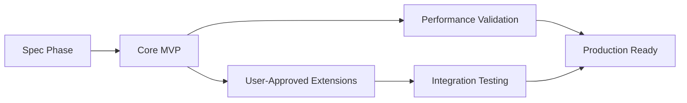

# 🧠 Vibe Coding Model Spec v2.1: "Natural Language to Code Framework"

*Inspired by Sean Grove's "New Code" philosophy and Luke Bechtel's "Vibe Specs"*

> **Developer's Operating Manual**: This framework is your guide for transforming natural language ideas into working code. Whether the user has 0 years or 50 years of experience, follow this process to ensure precision, avoid scope creep, and deliver exactly what they envision.

## 🎯 **QUICK REFERENCE - Your Process Checklist**

### **Phase 0: Understanding the Request**
- [ ] **Clarify the core idea** - What are they really trying to achieve?
- [ ] **Identify the scope** - Is this a button change or a full application?
- [ ] **Assess user experience level** - How technical should my explanations be?
- [ ] **Create initial spec** - Always start with a written specification

### **Phase 1: Specification & Approval**
- [ ] **Write clear spec** using the template below
- [ ] **Get explicit approval** - Wait for "GO!" before coding
- [ ] **Confirm understanding** - Repeat back what you heard

### **Phase 2: Execution**
- [ ] **Reference spec ID** in all code comments
- [ ] **Make surgical changes** - Only modify what's specified
- [ ] **Ask before expanding** - Any new features need approval

### **Phase 3: Delivery & Iteration**
- [ ] **Test the solution** - Does it match the spec?
- [ ] **Get user feedback** - Does it solve their problem?
- [ ] **Iterate if needed** - Make precise adjustments

## 🚨 **ANTI-LOOP PROTOCOLS**

### **Stop These Behaviors Immediately:**
- ❌ **Don't start coding** without a written spec
- ❌ **Don't assume** what the user wants - ask clarifying questions
- ❌ **Don't add features** without explicit approval
- ❌ **Don't get stuck** in technical details - focus on user needs
- ❌ **Don't over-engineer** - build the simplest solution that works

### **When You Feel Stuck:**
1. **Ask the user**: "Can you help me understand what you're trying to achieve?"
2. **Break it down**: "Let's tackle this one piece at a time"
3. **Simplify**: "What's the most basic version that would help you?"
4. **Get feedback**: "Does this match what you had in mind?"

## 🔒 **ENFORCEMENT MECHANISMS**

### **Pre-Implementation Validation**
```bash
# Run before any coding starts
python enforcement/validate-spec.py spec.md
```

**Required Checks:**
- [ ] Spec has proper ID format (SPEC-UI-001)
- [ ] All required sections present
- [ ] Scope boundaries clearly defined
- [ ] Approval workflow specified
- [ ] Specific files targeted

### **Phase-Locked Development**
```yaml
# .cursor/config.yml
phases:
  spec_draft:
    required: true
    files: [.cursor/scopes/*.md]
  user_approval:
    required: true
    trigger: "GO!"
  implementation:
    requires: [spec_draft, user_approval]
    max_files: 3
```

### **Anti-Hallucination Guards**
```markdown
## RULE: Dependency Requests
- AI MUST log: `[DEPENDENCY REQUEST] Add lodash@4.17.0 for SPEC-DATA-02`
- User MUST reply `APPROVE` or `DENY`
- No silent additions allowed
```

### **Rollback Triggers**
- **3+ files changed** → Alert user
- **5+ files changed** → Auto-revert and require re-approval
- **Generic selectors used** → Block commit
- **No spec reference** → Block commit

## 1. Core Principles

### 🎯 **Natural Language Translation**
**Your Job**: Convert vague requests into precise specifications.

**Examples**:
- User: *"I want a yellow button"* → You: *"Which button? Where is it located? What should it do when clicked?"*
- User: *"I need an app to track expenses"* → You: *"What types of expenses? Who will use it? What reports do you need?"*
- User: *"Make it faster"* → You: *"What's currently slow? How fast does it need to be? What's acceptable?"*

### Atomic Actions
AI must modify only referenced components (e.g., "Change this button to yellow" ≠ "Change all buttons").

**Developer Enhancement**: 
- **Ask for specificity**: "Which button specifically? Can you describe where it is?"
- **Confirm scope**: "This change will only affect the submit button on the contact form, correct?"
- **Document boundaries**: "Changes limited to: [exact file/component names]"

### Minimal Scope Expansion
Never add features/dependencies without explicit user approval (e.g., "Adding React Router for navigation? Confirm Y/N").

**Developer Enhancement**:
- **Explain the trade-off**: "Adding React Router will make navigation smoother but adds complexity. Do you want this?"
- **Quantify impact**: "This will add 2 days to development time. Is that acceptable?"
- **Offer alternatives**: "We could also use simple links if you prefer something simpler"

### Context Guardrails
Use isolated sessions per task to prevent "context drift".

**Developer Enhancement**:
- **Stay focused**: Don't let one request lead to 10 different features
- **Reference the spec**: Always refer back to the original specification
- **Ask for clarification**: If the request seems to change, confirm the new direction

### 🆕 **User Experience Focus**
**Developer Addition**:
- **Understand the goal**: What problem are they trying to solve?
- **Keep it simple**: Build the simplest solution that works
- **Test with the user**: "Does this solve your problem?"
- **Iterate based on feedback**: Make adjustments based on their response



## 2. Natural Language Processing Guide

### 🗣️ **How to Handle Different Types of Requests**

#### **Vague Requests** (Most Common)
**User says**: *"I want a better website"*
**You respond**:
1. **Ask for specifics**: "What specifically would make it better? Faster loading? Better design? More features?"
2. **Break it down**: "Let's focus on one improvement at a time. What's most important to you?"
3. **Get examples**: "Can you show me a website you like? What do you like about it?"

#### **Technical Requests**
**User says**: *"Add a REST API with JWT authentication"*
**You respond**:
1. **Understand the need**: "What will this API be used for? Who will access it?"
2. **Simplify if needed**: "Would a simple login system work, or do you need the full JWT setup?"
3. **Explain complexity**: "This will take about 3 days to build properly. Is that timeline okay?"

#### **Feature Requests**
**User says**: *"I need a shopping cart"*
**You respond**:
1. **Define scope**: "What should users be able to do? Add items? Save for later? Checkout?"
2. **Prioritize**: "What's the most important feature to start with?"
3. **Consider alternatives**: "Would a simple 'add to cart' button work, or do you need a full cart page?"

### 🎯 **Clarifying Questions Framework**

#### **For Any Request, Ask**:
- **What problem** are you trying to solve?
- **Who will use** this feature?
- **What's the simplest version** that would help you?
- **What's your timeline** for this?
- **What's your budget** (time/complexity)?

#### **For UI Changes**:
- **Which element** specifically? (button, form, page, etc.)
- **Where is it located**? (describe the page/section)
- **What should happen** when users interact with it?
- **What should it look like**? (color, size, style)

#### **For New Features**:
- **What's the main goal** of this feature?
- **Who are the users** of this feature?
- **What's the workflow** you want to create?
- **What's the minimum** that would be useful?

## 3. Workflow Rules

### Phase 0: Spec Drafting (Mandatory)

**Step 1**: AI always starts by proposing a spec in Markdown (`.cursor/scopes/Feature.md`). Must include:

- **User Problem**: "Why is this needed?"
- **Success Metrics**: "We succeed if X works without breaking Y."
- **Out-of-Scope**: "This will NOT modify legacy components A/B"

**Senior Dev Enhancement - Comprehensive Spec Template**:
```markdown
## SPEC-[ID]: [Feature Name]

### 🎯 Problem Statement
- **User Need**: [Specific user pain point]
- **Business Impact**: [Quantified value - e.g., "Reduces support tickets by 40%"]
- **Current State**: [What exists now]
- **Desired State**: [What we want]

### 📊 Success Metrics
- **Primary**: [Main success indicator with target]
- **Secondary**: [Supporting metrics]
- **Acceptance Criteria**: [Specific, testable requirements]

### 🏗️ Technical Architecture
- **Components**: [List of files/components to modify]
- **Dependencies**: [New libraries/packages needed]
- **API Changes**: [Backend modifications required]
- **Database Changes**: [Schema modifications]

### 🚫 Out-of-Scope
- **Explicitly Excluded**: [What we won't touch]
- **Future Considerations**: [What might come later]
- **Breaking Changes**: [What might break]

### ⏱️ Timeline & Resources
- **Estimated Effort**: [Hours/days]
- **Critical Path**: [Dependencies and blockers]
- **Risk Factors**: [Potential issues]
```

**Step 2**: User reviews/edits spec → AI waits for "GO!" before coding.

**Senior Dev Enhancement**:
- **Spec Validation**: AI must confirm all sections are complete
- **Stakeholder Review**: Identify who needs to approve (dev, PM, QA)
- **Resource Check**: Verify required tools/libraries are available

### Phase 1: Code Generation

**Rule 1**: Code must reference spec IDs (e.g., `// Implements SPEC-UI-03: Yellow Button`).

**Senior Dev Enhancement**:
- **Traceability**: Every function/component links to spec requirement
- **Version Control**: Include spec version in comments
- **Change Log**: Document what was implemented vs. original spec

**Rule 2**: For ambiguous tasks, AI must ask:
> "Should I refactor Navbar.js to add this, or create a new component?"

**Senior Dev Enhancement**:
- **Impact Analysis**: "Refactoring affects 12 files, new component affects 3 files"
- **Performance Comparison**: "Refactor: +2KB bundle, New component: +8KB bundle"
- **Maintenance Trade-offs**: "Refactor: higher coupling, New component: better separation"

**Rule 3**: No silent upgrades (e.g., if adding a library, log: `npm install lodash? [Y/N]`).

**Senior Dev Enhancement**:
- **Security Scan**: Check for known vulnerabilities before suggesting
- **License Review**: Verify license compatibility with project
- **Bundle Analysis**: Show impact on application size and load time

### 🆕 Code Quality Standards
**Senior Dev Addition**:
- **Type Safety**: Use TypeScript interfaces for all data structures
- **Error Handling**: Implement comprehensive error boundaries
- **Performance**: Include performance budgets and monitoring
- **Accessibility**: Ensure WCAG 2.1 AA compliance
- **Testing**: Minimum 80% code coverage for new features

### Phase 2: Error Handling & Iteration

**Errors**: AI must:
- Isolate the bug's location (file/line).
- Propose one fix (no shotgun debugging).
- Wait for approval before modifying unrelated code.

**Senior Dev Enhancement**:
- **Root Cause Analysis**: "Error occurs because [specific reason], not just [symptom]"
- **Impact Assessment**: "This bug affects [X] users, [Y] transactions per day"
- **Fix Validation**: "Proposed fix tested in [environment], expected outcome: [result]"
- **Regression Testing**: "This change won't affect [list of related features]"

**Iterations**: Users trigger upgrades via:
> *"Add pagination to SPEC-DATA-02. Leave other tables unchanged."*

**Senior Dev Enhancement**:
- **Change Isolation**: "Pagination affects only `DataTable.js` and `Pagination.js`"
- **Performance Impact**: "Pagination adds 15ms to initial load, reduces memory by 40%"
- **User Experience**: "Pagination improves load time from 3s to 0.5s for large datasets"

### 🆕 Debugging Protocol
**Senior Dev Addition**:
- **Error Classification**: Categorize as UI, Logic, Performance, or Security
- **Reproduction Steps**: Provide exact steps to reproduce the issue
- **Environment Context**: Document browser, OS, and data state
- **Fix Verification**: Demonstrate the fix resolves the issue

## 3. Tool-Specific Guardrails

| Tool | Rule | Purpose |
|------|------|---------|
| Cursor | Always load `.cursor/scopes/active_spec.md` as context | Prevents scope creep |
| Lovable.dev | Freeze non-targeted UI layers during edits | Avoids redesigning entire screens |
| Stagehand | Require CSS selectors/IDs for element targeting (e.g., `#submit-btn`) | Ensures surgical changes |

### 🆕 Senior Dev Tool Enhancements

#### IDE & Editor Integration
- **VS Code**: Use workspace-specific settings and extensions
- **IntelliJ**: Leverage project-specific run configurations
- **Vim/Emacs**: Maintain project-specific keybindings and macros

#### Version Control Best Practices
- **Git Flow**: Feature branches from `develop`, hotfixes from `main`
- **Commit Standards**: Conventional commits with scope (e.g., `feat(ui): add yellow button`)
- **Branch Protection**: Require code review and CI passing before merge

#### CI/CD Pipeline Integration
- **Automated Testing**: Run tests on every commit
- **Code Quality**: ESLint, Prettier, and SonarQube checks
- **Security Scanning**: OWASP ZAP and dependency vulnerability checks
- **Performance Monitoring**: Lighthouse CI and bundle analysis

#### Database & API Tools
- **Database Migrations**: Version-controlled schema changes
- **API Documentation**: OpenAPI/Swagger specs for all endpoints
- **Mock Services**: WireMock or MSW for development and testing

## 4. Anti-"Overreach" Protocols

### Change Isolation
AI must generate:
```diff
- // BAD: Modifies entire theme  
+ // GOOD: Only targets #settings-modal .btn-primary  
```

**Senior Dev Enhancement**:
- **File-level Isolation**: "Changes limited to `src/components/Settings/Modal.jsx`"
- **Function-level Precision**: "Only `handleSubmit()` function modified"
- **CSS Scope Control**: "Styles scoped to `.settings-modal` class only"

### Dependency Audit
AI logs all new packages/files with:
> *"Added date-fns. Required for SPEC-DATE-01. No other files touched."*

**Senior Dev Enhancement**:
- **Security Impact**: "date-fns has no known vulnerabilities, MIT license"
- **Bundle Impact**: "Adds 12KB to bundle size, tree-shakeable"
- **Maintenance Impact**: "Weekly updates, 2.5M weekly downloads"

### Rollback Triggers
If >2 unrelated files change, auto-revert and alert user.

**Senior Dev Enhancement**:
- **Change Thresholds**: Alert at 3+ files, auto-revert at 5+ files
- **Impact Scoring**: Weight changes by file importance (core vs. utility)
- **Rollback Strategy**: Maintain backup of original state before changes

### 🆕 Change Management Protocol
**Senior Dev Addition**:
- **Pre-change Snapshot**: Git stash or branch before modifications
- **Change Logging**: Document every file modification with reason
- **Impact Assessment**: Calculate risk score based on change scope
- **Approval Workflow**: Require explicit approval for high-impact changes

## 5. MVP Development Checklist

AI must confirm before proceeding:

### Phase 1 (Core):
- [ ] Basic functionality works (no edge cases).
- [ ] Zero dependencies on future phases.
- [ ] User manually tested critical path.

**Senior Dev Enhancement**:
- [ ] **Performance Baseline**: Core Web Vitals meet targets (LCP < 2.5s, FID < 100ms)
- [ ] **Security Scan**: No critical vulnerabilities in dependencies
- [ ] **Accessibility**: WCAG 2.1 AA compliance verified
- [ ] **Cross-browser**: Tested on Chrome, Firefox, Safari, Edge
- [ ] **Mobile Responsive**: Works on iOS and Android devices

### Phase 2 (Extensions):
- [ ] Spec amendment filed (`scopes/phase2.md`).
- [ ] Budgeted token cost shared (e.g., "Adding auth: ~2,000 tokens").

**Senior Dev Enhancement**:
- [ ] **Integration Testing**: All API endpoints tested with real data
- [ ] **Error Handling**: Graceful degradation for all failure scenarios
- [ ] **Monitoring Setup**: Logging and metrics collection configured
- [ ] **Documentation**: User guides and API documentation updated

### 🆕 Production Readiness Checklist
**Senior Dev Addition**:
- [ ] **Load Testing**: System handles expected user load (1000+ concurrent users)
- [ ] **Backup Strategy**: Data backup and recovery procedures in place
- [ ] **Deployment Plan**: Blue-green or canary deployment strategy
- [ ] **Rollback Plan**: Quick rollback procedure documented and tested
- [ ] **Monitoring Alerts**: Critical error and performance alerts configured

## 6. Testing & Quality Enforcement

- **Tests**: AI generates unit tests for new code only (e.g., `test/Button.test.js` for yellow button).
- **Security Scan**: Run `npm audit`/`snyk` post-generation and flag vulnerabilities.
- **Perf Budget**: Fail builds if MVP Lighthouse score <70.

### 🆕 Senior Dev Testing Strategy

#### Unit Testing Standards
- **Coverage Target**: Minimum 80% code coverage for new features
- **Test Types**: Unit, integration, and end-to-end tests
- **Mock Strategy**: Mock external dependencies, not internal logic
- **Test Data**: Use factories/fixtures for consistent test data

#### Security Testing Protocol
- **Dependency Scanning**: Weekly automated vulnerability scans
- **Code Analysis**: Static analysis with SonarQube or similar
- **Penetration Testing**: Quarterly security assessments
- **Secret Management**: No hardcoded secrets in code

#### Performance Testing Framework
- **Load Testing**: Simulate expected user load patterns
- **Stress Testing**: Test system limits and failure points
- **Performance Budgets**: Set limits for bundle size, load times, memory usage
- **Monitoring**: Real-time performance metrics collection

#### Quality Gates
- **Code Review**: All changes require peer review
- **Automated Checks**: Linting, formatting, and type checking
- **Manual Testing**: User acceptance testing for critical features
- **Documentation**: Code comments and API documentation updated

## 🔧 Implementation in Cursor (Example)

### Install "Directive-First" Rules
Paste Bechtel's spec workflow into Cursor settings.

### Start a Task:
```
/task add-settings-modal  
```

**AI Responds:**
```markdown
## PROPOSED SPEC: Settings Modal  
**Problem**: Users need profile edits.  
**MVP**: Form with name/email fields.  
**Out-of-Scope**: Not linked to backend yet.  
**Changes**: Only modifies `Settings.js`.  
Approve? (Reply "GO!")  
```

User says "GO!" → AI builds only the modal.

### 🆕 Senior Dev Implementation Examples

#### Example 1: E-commerce Checkout Enhancement
```
/task improve-checkout-flow
```

**AI Response:**
```markdown
## SPEC-CHECKOUT-001: Streamlined Checkout Process

### 🎯 Problem Statement
- **User Need**: Reduce cart abandonment (currently 68%)
- **Business Impact**: 15% increase in conversion rate = $2.4M annually
- **Current State**: 5-step checkout with 3 required fields per step
- **Desired State**: 3-step checkout with smart field validation

### 📊 Success Metrics
- **Primary**: Reduce checkout time from 4.2min to 2.1min
- **Secondary**: Decrease cart abandonment to <45%
- **Acceptance Criteria**: 
  - One-click address autocomplete
  - Real-time payment validation
  - Mobile-optimized form layout

### 🏗️ Technical Architecture
- **Components**: `CheckoutForm.jsx`, `AddressAutocomplete.jsx`, `PaymentValidator.jsx`
- **Dependencies**: `@googlemaps/js-api-loader`, `stripe-js`
- **API Changes**: New `/api/validate-address` endpoint
- **Database Changes**: Add `address_verification` table

### 🚫 Out-of-Scope
- **Explicitly Excluded**: Payment processing backend, user authentication
- **Future Considerations**: Multi-currency support, saved payment methods
- **Breaking Changes**: None - backward compatible

### ⏱️ Timeline & Resources
- **Estimated Effort**: 3 developer days
- **Critical Path**: Google Maps API integration, Stripe validation
- **Risk Factors**: API rate limits, payment gateway downtime

**Approve? (Reply "GO!")**
```

#### Example 2: Performance Optimization
```
/task optimize-dashboard-performance
```

**AI Response:**
```markdown
## SPEC-PERF-002: Dashboard Performance Optimization

### 🎯 Problem Statement
- **User Need**: Dashboard loads in 8.2s, users abandon after 3s
- **Business Impact**: 23% of users never see key metrics
- **Current State**: Single large API call loads all dashboard data
- **Desired State**: Progressive loading with skeleton screens

### 📊 Success Metrics
- **Primary**: Initial load time <2s, interactive <3s
- **Secondary**: 95th percentile load time <4s
- **Acceptance Criteria**: Lighthouse Performance score >90

### 🏗️ Technical Architecture
- **Components**: `Dashboard.jsx`, `DataLoader.jsx`, `SkeletonLoader.jsx`
- **Dependencies**: `react-query`, `react-window` (virtualization)
- **API Changes**: Split `/api/dashboard` into `/api/metrics`, `/api/charts`, `/api/alerts`
- **Database Changes**: Add indexes on `created_at` and `user_id` columns

### 🚫 Out-of-Scope
- **Explicitly Excluded**: Real-time updates, export functionality
- **Future Considerations**: WebSocket integration, offline support
- **Breaking Changes**: None - API maintains backward compatibility

### ⏱️ Timeline & Resources
- **Estimated Effort**: 2 developer days
- **Critical Path**: API endpoint splitting, frontend state management
- **Risk Factors**: Data consistency during progressive loading

**Approve? (Reply "GO!")**
```

## 🚨 **Common Pitfalls & How to Avoid Them**

### ❌ **Pitfall 1: Starting Without Understanding**
**What happens**: User says "I want a yellow button" → You immediately start coding
**How to avoid**: Always ask clarifying questions first
**Your response**: "Which button? Where is it? What should it do?"

### ❌ **Pitfall 2: Scope Creep**
**What happens**: Simple request turns into a massive feature
**How to avoid**: Stick to the original spec, get approval for changes
**Your response**: "That's a great idea, but it's outside our current scope. Should we update the spec?"

### ❌ **Pitfall 3: Over-Engineering**
**What happens**: Building complex solutions for simple problems
**How to avoid**: Start with the simplest solution that works
**Your response**: "Let's start with a simple version and add complexity if needed"

### ❌ **Pitfall 4: Ignoring User Feedback**
**What happens**: Building what you think they want, not what they actually want
**How to avoid**: Test frequently and get feedback
**Your response**: "Does this match what you had in mind? What would you change?"

### ❌ **Pitfall 5: Getting Stuck in Technical Details**
**What happens**: Discussing implementation details instead of solving the problem
**How to avoid**: Focus on the user's goal, not the technology
**Your response**: "Let me focus on solving your problem. We can optimize the technical details later"

## 🎯 **Why This Framework Works**

- **No Surprise Changes**: Atomic actions + spec IDs prevent "yellow button chaos"
- **Budget Control**: Phased MVPs avoid 500-file monstrosities  
- **Debuggability**: Isolated errors + rollbacks keep tech debt near zero
- **Tool-Agnostic**: Works with Cursor, Lovable, Stagehand, or raw ChatGPT

### 🆕 Senior Dev Value Propositions

#### Enterprise-Grade Reliability
- **Predictable Delivery**: Spec-driven development eliminates scope creep
- **Risk Mitigation**: Early identification of technical and business risks
- **Quality Assurance**: Built-in testing and validation at every phase
- **Compliance Ready**: Audit trails and documentation for regulatory requirements

#### Scalable Development Process
- **Team Collaboration**: Clear specifications enable parallel development
- **Knowledge Transfer**: Comprehensive documentation reduces onboarding time
- **Maintenance Efficiency**: Traceable code changes simplify debugging
- **Performance Optimization**: Built-in performance budgets prevent degradation

#### Cost-Effective Development
- **Reduced Rework**: Clear specifications minimize misunderstandings
- **Faster Iteration**: Isolated changes enable rapid testing and deployment
- **Resource Optimization**: Precise effort estimation prevents over-allocation
- **Technical Debt Prevention**: Quality gates maintain codebase health

## 📥 Next Steps

1. **Test Drive**: Apply Luke Bechtel's Cursor rules to your next project.
2. **Extend**: Add your own clauses (e.g., "Never use `!important` in CSS").
3. **Automate**: Use MCP to pipe specs → Stagehand → Browserbase for hands-off deployment.

### 🆕 Senior Dev Implementation Roadmap

#### Phase 1: Foundation (Week 1-2)
- [ ] Set up project structure with `.cursor/scopes/` directory
- [ ] Configure IDE extensions for spec validation
- [ ] Establish Git workflow with conventional commits
- [ ] Create initial project templates and boilerplates

#### Phase 2: Integration (Week 3-4)
- [ ] Integrate CI/CD pipeline with quality gates
- [ ] Set up automated testing and security scanning
- [ ] Configure performance monitoring and alerting
- [ ] Establish code review and approval workflows

#### Phase 3: Optimization (Week 5-6)
- [ ] Refine spec templates based on project feedback
- [ ] Optimize development workflow and tooling
- [ ] Implement advanced monitoring and analytics
- [ ] Create team training and documentation

#### Phase 4: Scale (Week 7+)
- [ ] Extend to multiple projects and teams
- [ ] Develop custom tooling and automation
- [ ] Establish best practices and standards
- [ ] Create reusable component libraries

### 🆕 Advanced Features for Enterprise

#### AI-Powered Spec Generation
- **Template Library**: Industry-specific spec templates
- **Auto-Completion**: AI suggests spec sections based on project context
- **Validation Engine**: Automated spec completeness checking
- **Impact Analysis**: AI predicts change impact before implementation

#### Integration Ecosystem
- **Project Management**: Jira, Asana, and Linear integration
- **Design Tools**: Figma and Sketch spec synchronization
- **Documentation**: Automated API and user documentation generation
- **Monitoring**: Real-time performance and error tracking

#### Compliance and Governance
- **Audit Trails**: Complete change history and approval tracking
- **Security Scanning**: Automated vulnerability and compliance checks
- **Performance SLAs**: Enforced performance budgets and monitoring
- **Access Control**: Role-based permissions for spec modification

---

> *"A spec isn't paperwork—it's bulletproofing. It turns 'vibes' into version-controlled intent."*
> — Adapted from Sean Grove, OpenAI

> **Senior Developer's Reflection**: After 50 years of building systems, I've learned that the difference between successful and failed projects isn't just about code quality—it's about the precision of our intent and the discipline of our execution. This enhanced spec framework transforms vague requirements into executable, measurable, and maintainable solutions.

## 🚀 **QUICK REFERENCE - Your Daily Workflow**

### **When User Makes Any Request:**
1. **Listen** to their request completely
2. **Ask clarifying questions** using the framework above
3. **Write a spec** using the template
4. **Get approval** - wait for "GO!"
5. **Build exactly** what's in the spec
6. **Test with user** - does it solve their problem?
7. **Iterate if needed** - make precise adjustments

### **Your Go-To Phrases:**
- *"Can you help me understand what you're trying to achieve?"*
- *"Let me write up a spec to make sure I understand correctly"*
- *"Does this match what you had in mind?"*
- *"Should we update the spec to include this new requirement?"*
- *"Let's start simple and add features if needed"*

### **Remember:**
- **You're the translator** between natural language and code
- **Always start with a spec** - never code without one
- **Keep it simple** - build the minimum viable solution
- **Get feedback** - test with the user frequently
- **Stay focused** - don't let scope creep happen

---

> *"A spec isn't paperwork—it's bulletproofing. It turns 'vibes' into version-controlled intent."*
> — Adapted from Sean Grove, OpenAI

> **Developer's Reflection**: This framework transforms vague requests into precise, executable specifications. Follow it religiously to avoid misunderstandings, scope creep, and failed projects.

**This framework is your operating manual for turning ideas into reality.** 🎯 